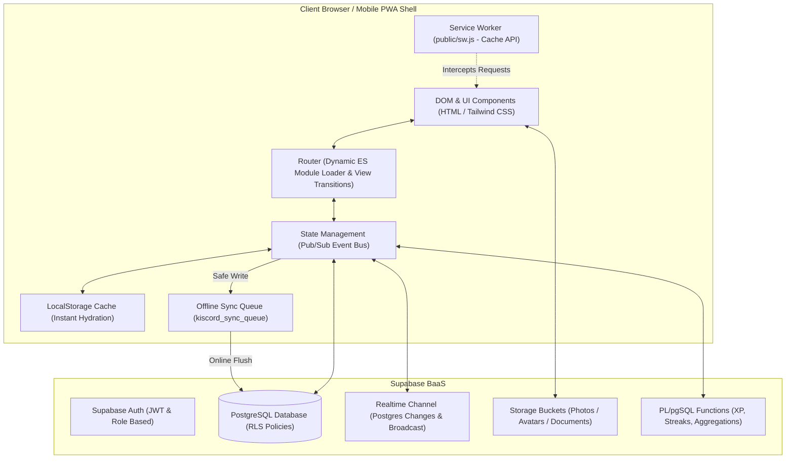

# 💖 Kiscord (Project-K)

> **A private, Discord-inspired Progressive Web App (PWA)** built for two users (**Josef & Klárka**). Combines relationship life, university companion tools for VUT FIT Brno, a comprehensive fitness and gym tracker, a media entertainment hub, and a shared memory archive with complete offline resilience.

[](https://vitest.dev/)
[](https://supabase.com/)
[](https://web.dev/progressive-web-apps/)
[](https://vercel.com/)

---

## ⚡ Quick Start

### Prerequisites

| Tool | Recommended Version | Purpose | Link |
|---|---|---|---|
| **Node.js** | `20.x` or `22.x` (LTS) | JavaScript runtime & npm scripts | [nodejs.org](https://nodejs.org) |
| **npm** | `10.x+` | Package manager | Bundled with Node.js |
| **Python** | `3.10+` | Documentation & onboarding tooling | [python.org](https://python.org) |
| **Supabase CLI** | `2.x` (Optional for local DB) | Schema management & migrations | [supabase.com/docs](https://supabase.com/docs) |

### Setup (< 5 minutes)

```bash
# 1. Clone the repository
git clone https://github.com/josefmvalek/project-k.git
cd project-k

# 2. Install dependencies
npm install

# 3. Start local development server (Vite)
npm run dev

# 4. Run unit and integration tests
npm run test:run
```

> [!TIP]
> The app runs on `http://localhost:5173`. Thanks to Vite HMR (Hot Module Replacement), changes to JS, CSS, and HTML files are reflected immediately without manual page refreshes.

### Verification Checklist

- [ ] Dev server is accessible at `http://localhost:5173` with no console errors.
- [ ] All 18 test suites (125 tests) pass cleanly via `npm run test:run`.
- [ ] Opening the app in a browser renders the Discord-themed dashboard and channel sidebar.
- [ ] DevTools $\rightarrow$ Application confirms the Service Worker is registered and `localStorage` is hydrated.

---

## 🏛️ System Architecture

The application is structured as a high-performance **Single Page Application (SPA)** written in pure Vanilla JavaScript (ES6+ Modules), driven by a reactive centralized state (Pub/Sub Event Bus), and powered by a serverless **Supabase** backend.



---

## 💻 Technology Stack

| Layer | Technology | Rationale |
|---|---|---|
| **Core Frontend** | Vanilla JavaScript (ES6 Modules) | Zero runtime overhead, instantaneous rendering, full DOM/memory control, zero framework churn |
| **Styling & Theming** | Custom CSS Variables + Tailwind CSS | Authentic Discord Dark UI, 7 switchable themes, glassmorphism, fluid micro-interactions |
| **Build & Dev Tool** | Vite 6 | Lightning-fast startup, Hot Module Replacement (HMR), optimized asset bundling |
| **Backend & DB** | Supabase (PostgreSQL 15+) | Row Level Security (RLS), Realtime WebSockets, Storage buckets, PL/pgSQL RPC procedures |
| **Offline & PWA** | Service Worker + Cache API | Immediate offline startup, 3-tier caching strategy, zero-data-loss offline sync queue |
| **Testing** | Vitest & Playwright | Rapid in-memory unit/integration tests with Happy-DOM + real-browser end-to-end testing |
| **Hosting & CI/CD** | Vercel | Automatic deployments and preview branches on every Git push |

---

## 📁 Repository Structure & Key Directories

```
kiscord/
├── .agents/skills/          # AI agent skills (codebase-onboarding, md-document, etc.)
├── css/                     # Stylesheets (design tokens, components, animations)
│   ├── animations.css       # Keyframes and transition curves
│   ├── app.css              # Global rules and layout structure
│   ├── components.css       # Discord-styled components, cards, modals
│   └── tokens.css           # 7 theme palettes and CSS custom properties
├── docs/                    # Technical & architectural documentation
│   ├── core/                # Core specs (state, routing, realtime sync)
│   ├── modules/             # Module group documentation
│   ├── developer-onboarding.html # Interactive single-file HTML onboarding guide
│   ├── architecture.md      # Application architecture & lifecycle
│   ├── database.md          # PostgreSQL schemas, RLS, RPC & Storage
│   └── dev-ops.md           # PWA, Service Worker caching & CI/CD
├── js/
│   ├── core/                # Core singletons & infrastructure
│   │   ├── auth.js          # Supabase authentication & session handling
│   │   ├── globals.js       # Global constants and helpers
│   │   ├── loaders.js       # On-demand lazy data loaders
│   │   ├── offline.js       # Sync queue (kiscord_sync_queue) & safe write APIs
│   │   ├── router.js        # Dynamic module routing & View Transitions
│   │   ├── state.js         # Reactive state container & Pub/Sub event bus
│   │   ├── sync.js          # Supabase Realtime broadcast & Postgres changes
│   │   └── theme.js         # Engine for 7 visual themes
│   ├── modules/             # 55+ discrete functional modules
│   │   ├── gym/             # Complete gym tracker (15 submodules, HUD, PRs, anatomy)
│   │   ├── calendar/        # Calendar & date planning submodules
│   │   ├── dashboard/       # Daily hub, sunflower sync, hydration, sleep tracker
│   │   ├── matura/          # Study hub & knowledge base
│   │   ├── library.js       # Movies, series & games catalogue
│   │   ├── watchlist.js     # Shared watchlist & Tinder Matcher
│   │   ├── loveShop.js      # Couple coupon shop & pantry
│   │   └── ...              # Additional modules
│   └── main.js              # Application entry point
├── public/                  # Static assets, icons, manifest
│   ├── manifest.json        # PWA manifest
│   └── sw.js                # Service Worker with 3-tier caching strategy
├── supabase/                # Database migrations, SQL scripts & schemas
│   └── migrations/          # Incremental database migrations
├── tests/                   # Automated test suites
│   ├── e2e/                 # Playwright end-to-end browser tests
│   ├── integration/         # Integration test suites (offline sync, themes)
│   └── unit/                # Vitest unit tests for modules and core utilities
├── index.html               # Main application shell
├── package.json             # NPM dependencies and scripts
├── vite.config.js           # Vite bundler configuration
└── vitest.config.js         # Vitest test runner configuration
```

---

## 📺 Channel & Module Catalog (7 Categories)

Kiscord organizes its 55+ modules into an authentic Discord channel hierarchy:

### 1. 📌 Pinned (Always at Top)
- **`#dashboard`** (`dashboard.js`): *Můj Den (My Day)* — Personal daily overview, hydration tracker (8 water droplets), sleep tracker with active session timer, sunflower mood sync, fact of the day, and quick notes.
- **`#kalendář`** (`calendar.js`): *Kalendář (Calendar)* — Monthly date planner, university schedule, work shifts, and memory highlights with integrated mood heatmap.

### 2. 🎓 VUT FIT & KOLEJE (University & Dorm Life)
- **`#rozvrh`** (`schedule.js`): VUT FIT weekly timetable with campus room hints and automated joint free window calculator.
- **`#studijní-plán`** (`studyPlanner.js`): WIS point tracking, credit requirements, and project/exam countdowns.
- **`#koleje-brno`** (`dormHub.js`): Dorm laundry room machine booking, packing checklist, and university cafeteria menu radar.
- **`#finance`** (`financeTracker.js`): Personal budget in Brno + savings piggy bank (*Kasička*) with financial milestones.
- **`#počítač`** (`laptopComparison.js`): Laptop comparison matrix and buyer's guide for CS students.

### 3. 🌿 ZDRAVÍ & FITNESS (Health & Gym)
- **`#posilovna`** (`gym/`): Complete gym tracker (floating active workout HUD, rest timer with sound/haptics, 100+ exercises with GIFs, 1RM progression charts, muscle volume heatmap, couple gym streak, annual wrapped).
- **`#návyky`** (`habits.js`): Daily habit tracker rewarding Love Coins.
- **`#regenerace`** (`regenerace/`): Evidence-based supplement guide, recovery protocols, and wellness timeline.

### 4. 💖 NÁŠ SVĚT & PŘÍBĚH (Couple Life & Memories)
- **`#obchůdek`** (`loveShop.js`): Romantic coupon store redeemable with Love Coins and coupon inventory pantry.
- **`#plánovač-rande`** (`map.js`): Interactive Leaflet map with pinned date locations and routing.
- **`#bucket-list`** (`bucketlist.js`): Shared dream bucket list with priorities and completion photo uploads.
- **`#společné-questy`** (`quests.js`): Co-op monthly challenges and shared milestones.
- **`#denní-otázky`** (`dailyQuestions.js`) & **`#témata`** (`topics.js`): Daily conversational prompts and deep-talk card decks.
- **`#timeline`** (`timeline.js`): Relationship photo timeline and milestone albums.
- **`#dopisy`** (`letters.js`): Time-locked message capsules for future anniversaries.
- **`#achievementy`** (`achievements.js`): Gamified trophies celebrating couple milestones.

### 5. 🎮 ZÁBAVA & MÉDIA (Entertainment & Arcade Hub)
- **`#knihovna`** (`library.js`): Media catalogue with TMDB search, game modes (Stálice vs Backlog), and magnet link integration.
- **`#watchlist`** (`watchlist.js`): Mutual matches (*Spolu-seznam*), personal wishlists, **Tinder Matcher** (`netflixMatcher.js`), and **Dice of Chance** (*Kostka Náhody*).
- **`#gamesky`** (`gamesHub.js`): Central Arcade Hub unifying Draw Duel (real-time canvas), Who Is More Likely To?, Couple Quizzes, Memory Photo Puzzle, Tetris War Tracker, Tier Lists, and Fact Encyclopedia.
- **`#music-bot`** (`static.js`): Shared music playlist and web audio player.

### 6. 📦 ARCHIV (Default Collapsed)
- **`#rakousko-kasička`** (`kasicka.js`) & **`#rakousko-info`** (`austriaInfo.js`): Seasonal Alpine work earnings archive and guide.
- **`#plánovač-směn`** (`shifts.js`) & **`#rakouská-němčina`** (`austrianGerman.js`): Work shifts and Austrian dialect flashcards.
- **`#matura-*`** (`matura.js`): High school graduation knowledge base (Czech literature, IT systems, Pomodoro timer, text highlighter).

### 7. ⚙️ SYSTÉM & INFO (Default Collapsed)
- **`#statistiky`** (`stats.js`): Relationship data analytics and activity stats.
- **`#nastavení`** (`settings.js`): 7 visual themes switcher, audio/haptic preferences, profile manager, and cache cleanup.
- **`#changelog`** (`changelog.js`): Release version history.

---

## 🛠️ Developer Recipes & Workflows

### 1. Adding a New Channel / Module

1. Create a module file in `js/modules/myNewModule.js`:
   ```javascript
   export async function renderMyNewModule() {
       const container = document.getElementById('main-content');
       container.innerHTML = `
           <div class="channel-header">
               <h2><i class="fa-solid fa-sparkles text-accent"></i> My New Module</h2>
           </div>
           <div class="card p-4">Module content goes here...</div>
       `;
   }
   ```

2. Register the module in `js/core/router.js`:
   - Add to `moduleMap`:
     ```javascript
     'my-new-module': () => import('../modules/myNewModule.js'),
     ```
   - Add the channel descriptor to the appropriate category in `channelCategories`:
     ```javascript
     { id: 'my-new-module', name: 'my-new-module', icon: 'fa-sparkles', color: '#60a5fa', desc: 'Description' }
     ```

### 2. Writing to Database with Offline Support

Always leverage the safe wrappers from `offline.js` to ensure optimistic UI updates and background retry queuing:

```javascript
import { safeUpsert } from '../core/offline.js';
import { state, stateEvents } from '../core/state.js';

async function saveRecord(record) {
    // 1. Optimistic local state update
    state.myItems.push(record);
    stateEvents.emit('myItems');

    // 2. Safe write to Supabase (automatically queued if offline)
    await safeUpsert('my_table', record);
}
```

### 3. Running and Writing Tests

```bash
# Run all unit and integration tests once
npm run test:run

# Run tests in interactive watch mode
npm test

# Run tests with graphical UI
npm run test:ui

# Run Playwright E2E browser tests
npm run test:e2e
```

---

## 🔍 Debugging & Troubleshooting

> [!IMPORTANT]
> **Common developer issues and solutions:**

1. **User sees an outdated version after deployment**:
   - The Service Worker relies on versioned cache names. Increment `CACHE_NAME` in `public/sw.js` (e.g., `kiscord-v2.2.0`).
   - The user can also trigger **"Clear Cache and Reload"** in `#nastavení`.

2. **Offline mutations failed to synchronize**:
   - Check `localStorage.getItem('kiscord_sync_queue')` in DevTools.
   - Inspect console logs for network timeouts or database schema constraint errors.
   - When connection is restored, the `window.online` listener flushes the queue.

3. **Supabase 403 / RLS Permission Denied error**:
   - Verify that the user is authenticated via `supabase.auth.getUser()`.
   - Verify that the target table in `supabase/migrations/` has an active RLS policy for the `authenticated` role.

---

## 👥 Audience-Specific Guidance

### 👶 Junior Developer
- Start by exploring `js/core/state.js` and `js/core/router.js`.
- Review existing unit tests in `tests/unit/` as executable documentation of the module APIs.
- Verify UI changes across multiple visual themes (switchable in `#nastavení`).

### 🧑‍💻 Senior Architect
- Audit database schemas and indexes in `supabase/migrations/` before introducing heavy queries.
- Ensure WebSocket channels and event listeners are cleanly terminated in module cleanup hooks (e.g. `drawCleanup()`) upon channel transition to prevent memory leaks.
- Maintain code-splitting discipline to keep initial load times under 200ms.

### 🤝 Contributor & Pair Programmer
- Always run `npm run test:run` before opening a pull request to ensure all tests pass.
- Follow conventional commit messages: `feat(scope): ...`, `fix(scope): ...`, `docs: ...`.
- Update corresponding documentation in `docs/` in the same PR.

---

## 📖 Documentation & Links

- 📚 [Full Technical Documentation](./docs/index.md)
- 🚀 [Interactive HTML Developer Guide (Single-File Onboarding)](./docs/developer-onboarding.html)
- 💾 [Database Model & Supabase Schemas](./docs/database.md)
- ⚙️ [DevOps, PWA & Caching Guide](./docs/dev-ops.md)
- 🤖 [LLM Context Index (`llms.txt`)](./llms.txt)
