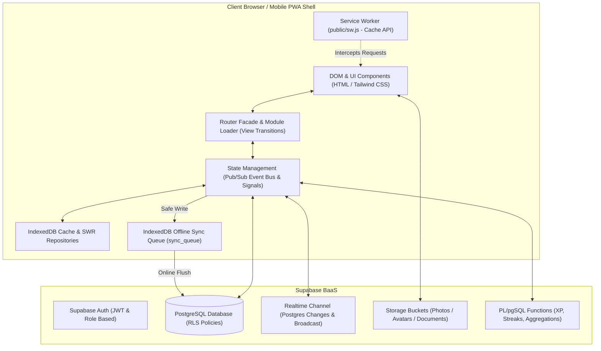

# 💖 Kiscord (Project-K)

> **A private, Discord-inspired Progressive Web App (PWA)** built for two users (**Josef & Klárka**). Combines relationship life, university companion tools for VUT FIT Brno, a comprehensive fitness and gym tracker, a media entertainment hub, and a shared memory archive with complete offline resilience.

[](https://vitest.dev/)
[](https://supabase.com/)
[](https://web.dev/progressive-web-apps/)
[](https://vercel.com/)

---

## ⚡ Quick Start

### Prerequisites

| Tool | Recommended Version | Purpose | Link |
|---|---|---|---|
| **Node.js** | `20.x` or `22.x` (LTS) | JavaScript runtime & npm scripts | [nodejs.org](https://nodejs.org) |
| **npm** | `10.x+` | Package manager | Bundled with Node.js |
| **Python** | `3.10+` | Documentation & onboarding tooling | [python.org](https://python.org) |
| **Supabase CLI** | `2.x` (Optional for local DB) | Schema management & migrations | [supabase.com/docs](https://supabase.com/docs) |

### Setup (< 5 minutes)

```bash
# 1. Clone the repository
git clone https://github.com/josefmvalek/project-k.git
cd project-k

# 2. Install dependencies
npm install

# 3. Start local development server (Vite)
npm run dev

# 4. Run unit and integration tests
npm run test:run

# 5. Type check
npm run typecheck
```

> [!TIP]
> The app runs on `http://localhost:3000` (or `http://localhost:5173`). Thanks to Vite HMR (Hot Module Replacement), changes to JS, CSS, and HTML files are reflected immediately without manual page refreshes.

### Verification Checklist

- [ ] Dev server is accessible with no console errors.
- [ ] All 75 test suites (528 tests) pass cleanly via `npm run test:run`.
- [ ] TypeScript check passes with 0 errors via `npm run typecheck`.
- [ ] Opening the app in a browser renders the Discord-themed server bar, dashboard, and channel sidebar.
- [ ] DevTools $\rightarrow$ Application confirms the Service Worker is registered and `IndexedDB` (`kiscord_db`) is hydrated.

---

## 🏛️ System Architecture

The application is structured as a high-performance **Single Page Application (SPA)** written in pure Vanilla JavaScript (ES6+ Modules), driven by a reactive centralized state (Pub/Sub Event Bus + Signals), and powered by a serverless **Supabase** backend.



---

## 💻 Technology Stack

| Layer | Technology | Rationale |
|---|---|---|
| **Core Frontend** | Vanilla JavaScript (ES6 Modules) | Zero runtime overhead, instantaneous rendering, full DOM/memory control, zero framework churn |
| **Styling & Theming** | Custom CSS Variables + Tailwind CSS v4 | Authentic Discord Dark UI, 7 switchable themes, glassmorphism, fluid micro-interactions |
| **Build & Dev Tool** | Vite 6 | Lightning-fast startup, Hot Module Replacement (HMR), optimized asset bundling |
| **Backend & DB** | Supabase (PostgreSQL 15+) | Row Level Security (RLS), Realtime WebSockets, Storage buckets, PL/pgSQL RPC procedures |
| **Offline & PWA** | Service Worker + IndexedDB (`idb.js`) | Immediate offline startup, 3-tier caching strategy, zero-data-loss offline sync queue |
| **Testing** | Vitest & Playwright | Rapid in-memory unit/integration tests with Happy-DOM (528+ tests) + real-browser end-to-end testing |
| **Hosting & CI/CD** | Vercel | Automatic deployments and preview branches on every Git push |

---

## 📁 Repository Structure & Key Directories

```
kiscord/
├── .agents/                 # AI agent workspace configuration
│   ├── hooks.json           # Lifecycle automation hooks (typecheck on edit)
│   └── skills/              # Custom & specialized skills (channel-workflow, supabase-sync)
├── css/                     # Stylesheets (design tokens, components, animations)
│   ├── animations.css       # Keyframes and transition curves
│   ├── app.css              # Global rules and layout structure
│   ├── components.css       # Discord-styled components, cards, modals
│   └── tokens.css           # 7 theme palettes and CSS custom properties
├── docs/                    # Technical & architectural documentation
│   ├── core/                # Core specs (state, routing, realtime sync)
│   ├── modules/             # Domain group documentation
│   ├── adr/                 # Architecture Decision Records (ADR 0001–0011)
│   ├── architecture.md      # Application architecture & lifecycle
│   ├── database.md          # PostgreSQL schemas, RLS, RPC & Storage
│   └── dev-ops.md           # PWA, Service Worker caching & CI/CD
├── js/
│   ├── core/                # Core singletons & infrastructure
│   │   ├── auth-handler.js  # Auth listeners and UI profiles
│   │   ├── idb.js           # High-capacity IndexedDB async storage engine
│   │   ├── loaders.js       # On-demand lazy data loaders
│   │   ├── module-lifecycle.js # CleanupCollector and unmount contract
│   │   ├── offline.js       # Safe write APIs & sync queue processor
│   │   ├── repositories/    # SWR data access layer (BaseRepository)
│   │   ├── router/          # Modular routing: channel-registry, module-loader, navigation
│   │   ├── router.js        # Router facade
│   │   ├── servers.js       # Discord 7-server architecture & navigation
│   │   ├── signals.js       # Fine-grained reactive signals engine
│   │   ├── state.js         # Reactive state container & Pub/Sub event bus
│   │   ├── sync.js          # Supabase Realtime broadcast & Postgres changes
│   │   └── theme.js         # Engine for 7 visual themes
│   ├── domains/             # Domain-Driven Design (Feature Modules)
│   │   ├── archive/         # Historical modules (Austria brigade, work shifts, Matura)
│   │   ├── couple/          # Couple intimacy (Love Shop, Letters, Quizzes, Wrapped)
│   │   ├── entertainment/   # Entertainment (Library, Watchlist, Tinder Matcher, Arcade)
│   │   ├── fitness/         # Health & fitness (Gym tracker, Nutrition, Body metrics)
│   │   ├── lifestyle/       # Daily hub (Dashboard #můj-den, Calendar 2.0, Date planner)
│   │   ├── system/          # System tools (Settings, Changelog, Profile, Manual)
│   │   └── university/      # VUT FIT studies (Schedule, Study planner, Dorm hub, Laptop)
│   ├── shared/              # Shared UI components, spotlight, and DOM utilities
│   ├── types/               # TypeScript definitions (database.d.ts)
│   └── main.js              # Application bootstrapper
├── public/                  # Static assets, icons, manifest
│   ├── manifest.json        # PWA manifest
│   └── sw.js                # Service Worker with 3-tier caching strategy
├── supabase/                # Database migrations, SQL scripts & schemas
│   └── migrations/          # Incremental database migrations
├── tests/                   # Automated test suites (75 files, 528+ tests)
│   ├── e2e/                 # Playwright end-to-end browser tests
│   ├── fixtures/            # Reusable test fixtures and mock builders
│   ├── integration/         # Integration test suites (offline sync, themes)
│   └── unit/                # Vitest unit tests for domains and core utilities
├── AGENTS.md                # AI Agent Instructions & System Context
├── llms.txt                 # AI LLM context index
├── package.json             # NPM dependencies and scripts
├── vite.config.js           # Vite bundler configuration
└── vitest.config.js         # Vitest test runner configuration
```

---

## 🖥️ Discord Multi-Server Architecture

Kiscord features an authentic Discord desktop & mobile interface structured into a 3-column layout:

```
┌───────────┬─────────────────────────┬──────────────────────────────────────────────────┐
│ SERVER    │ CHANNELS SIDEBAR        │ MAIN VIEW CONTAINER                              │
│ BAR       │                         │                                                  │
│           │ 🏠 Domov & Přehled      │                                                  │
│  [ 🏠 ]   ├─────────────────────────┤                                                  │
│  [ 💖 ]   │ ▼ 📌 HLAVNÍ PŘEHLED     │                                                  │
│  [ 🏋️‍♂️ ]   │   # ☀️ dashboard        │                 Active Channel                   │
│  [ 🎓 ]   │   # 📅 kalendář         │                 View Container                   │
│  [ 🎮 ]   │                         │              (Dynamic Lazy Load)                 │
│  [ 📦 ]   │ ▼ 💖 NÁŠ PŘÍBĚH         │                                                  │
│  [ ⚙️ ]   │   # 🪙 obchůdek         │                                                  │
│           │   # 🫀 dotek-na-dálku   │                                                  │
└───────────┴─────────────────────────┴──────────────────────────────────────────────────┘
```

1. **Left Server Bar (`servers.js`)**:
   - 7 distinct Discord servers with hover tooltips, active white pill indicators, and custom gradient icons.
   - Switching a server updates the channel list and server header without forcing an unwanted sub-channel jump.
2. **Channel Sidebar (`js/core/router/channel-registry.js`)**:
   - Collapsible categories with persistent state and unread badges.
3. **Main Content View (`js/core/router/module-loader.js`)**:
   - Lazy-loaded domain modules with View Transitions API and haptic feedback.

---

## 📺 Discord Server & Channel Catalog (7 Servers, 55+ Channels)

### 1. 🏠 Server: Domov & Přehled (`home`)
- **`#dashboard`** (`js/domains/lifestyle/dashboard/`): *Můj Den (My Day)* — Personal daily overview, hydration tracker (8 water droplets), sleep tracker with active session timer, sunflower mood sync, fact of the day, and quick notes.
- **`#kalendář`** (`js/domains/lifestyle/calendar/`): *Kalendář (Calendar)* — 24h week grid, fit-to-viewport month grid, date planner, university schedule, and mood heatmap.

### 2. 💖 Server: Náš Svět & Láska (`love`)
- **`#obchůdek`** (`js/domains/couple/love-shop/`): Romantic coupon store redeemable with Love Coins and coupon inventory pantry.
- **`#dotek-na-dálku`** (`js/domains/couple/haptic-touch.js`): Real-time Haptic Touchpad & heartbeat transmitter for long-distance connection 🫀
- **`#plánovač-rande`** (`js/domains/lifestyle/date-planner/`): Interactive Leaflet map with pinned date locations and routing.
- **`#bucket-list`** (`js/domains/lifestyle/bucketlist.js`): Shared dream bucket list with priorities and completion photo uploads.
- **`#společné-questy`** (`js/domains/entertainment/quests.js`): Co-op monthly challenges and shared milestones.
- **`#denní-otázky`** (`js/domains/couple/daily-questions.js`) & **`#témata`** (`js/domains/couple/topics/`): Daily conversational prompts and deep-talk card decks.
- **`#timeline`** (`js/domains/lifestyle/timeline/`): Relationship photo timeline and milestone albums.
- **`#dopisy`** (`js/domains/couple/letters/`): Time-locked message capsules for future anniversaries.
- **`#achievementy`** (`js/domains/entertainment/achievements.js`): Gamified trophies celebrating couple milestones.

### 3. 🏋️‍♂️ Server: Zdraví & Fitness (`fitness`)
- **`#posilovna`** (`js/domains/fitness/gym/`): Complete gym tracker (floating active workout HUD, rest timer with sound/haptics, 100+ exercises with GIFs, 1RM progression charts, muscle volume heatmap, couple gym streak, annual wrapped).
- **`#výživa`** (`js/domains/fitness/nutrition/`): Premium nutrition tracker with circular SVG calorie donut, 4 macro bars, Intermittent Fasting (IF) timer, MacroFactor adaptive TDEE coach, AI natural language food parser.
- **`#tělo-a-míry`** (`js/domains/fitness/body-metrics/`): Central biometrics hub with morning weight logs & EMA trend smoothing, 6 body circumferences, BMR/TDEE calculations, and FFMI index.
- **`#návyky`** (`js/domains/lifestyle/habits.js`): Daily habit tracker rewarding Love Coins.
- **`#regenerace`** (`js/domains/fitness/regenerace.js`): Evidence-based supplement guide, recovery protocols, and wellness timeline.

### 4. 🎓 Server: VUT FIT & Koleje (`fit`)
- **`#rozvrh`** (`js/domains/university/schedule.js`): VUT FIT weekly timetable with campus room hints and automated joint free window calculator.
- **`#studijní-plán`** (`js/domains/university/study-planner/`): WIS point tracking, credit requirements, and project/exam countdowns.
- **`#koleje-brno`** (`js/domains/university/dorm-hub.js`): Dorm laundry room machine booking, packing checklist, and university cafeteria menu radar.
- **`#finance`** (`js/domains/archive/finance/`): Personal budget in Brno + savings piggy bank (*Kasička*) with financial milestones.
- **`#počítač`** (`js/domains/university/laptop-comparison.js`): Laptop comparison matrix and buyer's guide for CS students.

### 5. 🎮 Server: Média & Zábava (`media`)
- **`#knihovna`** (`js/domains/entertainment/library/`): Media catalogue with TMDB search, game modes (Stálice vs Backlog), and magnet link integration.
- **`#watchlist`** (`js/domains/entertainment/watchlist.js`): Mutual matches (*Spolu-seznam*), personal wishlists, **Tinder Matcher** (`netflix-matcher.js`), and **Dice of Chance** (*Kostka Náhody*).
- **`#gamesky`** (`js/domains/entertainment/games-hub.js`): Central Arcade Hub unifying Draw Duel (real-time canvas), Who Is More Likely To?, Couple Quizzes, Memory Photo Puzzle, Tetris War Tracker, Tier Lists, and Fact Encyclopedia.
- **`#music-bot`** (`js/domains/system/static.js`): Shared music playlist and web audio player.

### 6. 📦 Server: Archiv (`archive`)
- **`#rakousko-kasička`** (`js/domains/archive/kasicka.js`) & **`#rakousko-info`** (`js/domains/archive/austria-info/`): Seasonal Alpine work earnings archive and guide.
- **`#plánovač-směn`** (`js/domains/archive/shifts.js`) & **`#rakouská-němčina`** (`js/domains/archive/austrian-german.js`): Work shifts and Austrian dialect flashcards.
- **`#matura-*`** (`js/domains/university/matura/`): High school graduation knowledge base (Czech literature, IT systems, Pomodoro timer, text highlighter).

### 7. ⚙️ Server: Systém & Nastavení (`system`)
- **`#statistiky`** (`js/domains/entertainment/stats.js`): Relationship data analytics and activity stats.
- **`#nastavení`** (`js/domains/system/settings/`): 7 visual themes switcher, audio/haptic preferences, profile manager, and cache cleanup.
- **`#changelog`** (`js/domains/system/changelog.js`): Release version history.

---

## 🛠️ Developer Recipes & Workflows

### 1. Adding a New Channel / Module

Follow the 5-step standard defined in `.agents/skills/kiscord-channel-workflow`:

1. **Register in `js/core/router/channel-registry.js`**:
   ```javascript
   { id: 'my-feature', name: 'Můj Kanál', icon: '✨', type: 'lifestyle', color: '#8b5cf6', desc: 'Popis' }
   ```

2. **Map Route in `js/core/router/module-loader.js`**:
   ```javascript
   'my-feature': {
       loader: () => import('../../domains/lifestyle/my-feature.js'),
       render: (m, c) => m.renderMyFeature(c)
   }
   ```

3. **Implement Domain Module in `js/domains/<domain>/my-feature.js`**:
   ```javascript
   import { CleanupCollector } from '../../core/module-lifecycle.js';
   export async function renderMyFeature(container) {
       const cleanups = new CleanupCollector();
       container.innerHTML = `<div class="p-6">Content</div>`;
       return { unmount() { cleanups.cleanup(); } };
   }
   ```

4. **Add Data Loader in `js/core/loaders.js`** using `isStale()`.

5. **Write Unit Test in `tests/unit/my-feature.test.js`** and verify with `npm run test:run`.

### 2. Writing to Database with Offline Support

Always leverage the safe wrappers from `offline.js` or SWR repositories from `repositories/`:

```javascript
import { safeUpsert } from '../core/offline.js';
import { state, stateEvents } from '../core/state.js';

async function saveRecord(record) {
    // 1. Optimistic local state update
    state.myItems.push(record);
    stateEvents.emit('myItems');

    // 2. Safe write to Supabase (automatically queued in IndexedDB if offline)
    await safeUpsert('my_table', record);
}
```

### 3. Running and Writing Tests

```bash
# Run all unit and integration tests (528 tests)
npm run test:run

# Run TypeScript static check
npm run typecheck

# Run tests in interactive watch mode
npm test

# Run tests with graphical UI
npm run test:ui

# Run Playwright E2E browser tests
npm run test:e2e
```

---

## 🔍 Debugging & Troubleshooting

1. **User sees an outdated version after deployment**:
   - Increment `CACHE_NAME` in `public/sw.js`.
   - The user can also trigger **"Clear Cache and Reload"** in `#nastavení`.

2. **Offline mutations failed to synchronize**:
   - Inspect the IndexedDB `kiscord_db` $\rightarrow$ `sync_queue` store in DevTools Application tab.
   - Inspect console logs for network timeouts or database schema constraint errors.
   - When connection is restored, the `window.online` listener flushes the queue automatically.

3. **Supabase 403 / RLS Permission Denied error**:
   - Verify that the user is authenticated via `supabase.auth.getSession()`.
   - Verify that the target table in `supabase/migrations/` has an active RLS policy for role `authenticated`.

---

## 👥 Audience-Specific Guidance

### 👶 Junior Developer
- Start by exploring `js/core/state.js`, `js/core/router/`, and `AGENTS.md`.
- Review existing unit tests in `tests/unit/` as executable documentation of the module APIs.
- Verify UI changes across multiple visual themes (switchable in `#nastavení`).

### 🧑‍💻 Senior Architect
- Audit database schemas and indexes in `supabase/migrations/` before introducing heavy queries.
- Ensure WebSocket channels, intervals, and event listeners are cleanly terminated in module cleanup hooks via `CleanupCollector`.
- Refer to Architecture Decision Records in `docs/adr/`.

### 🤝 Contributor & Pair Programmer
- Always run `npm run typecheck` and `npm run test:run` before opening a pull request to ensure all tests pass.
- Follow conventional commit messages: `feat(scope): ...`, `fix(scope): ...`, `docs: ...`.
- Update corresponding documentation in `docs/` in the same PR.

---

## 📖 Documentation & Links

- 📚 [Full Technical Documentation](./docs/index.md)
- 🚀 [Interactive HTML Developer Guide (Single-File Onboarding)](./docs/developer-onboarding.html)
- 🏛️ [Application Architecture & Lifecycle](./docs/architecture.md)
- 💾 [Database Model & Supabase Schemas](./docs/database.md)
- ⚙️ [DevOps, PWA & Caching Guide](./docs/dev-ops.md)
- 🤖 [LLM Context Index (`llms.txt`)](./llms.txt)
- 🤖 [Agent Instructions & Rules (`AGENTS.md`)](./AGENTS.md)
