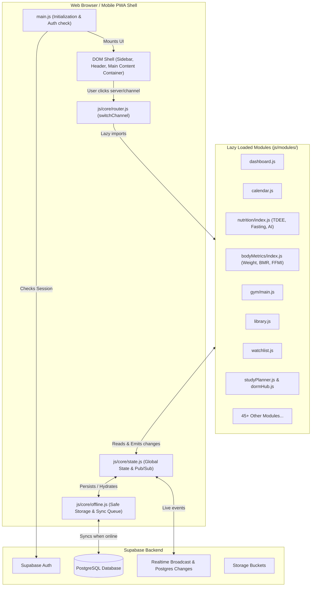
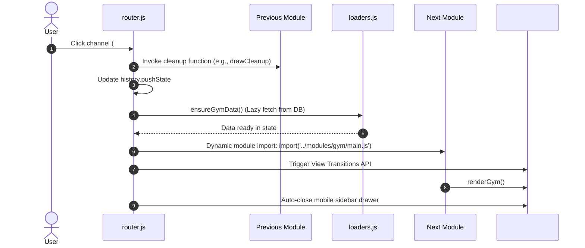

# 🏛️ Architecture & System Core

> This document provides a comprehensive technical overview of the **Kiscord** application architecture.  
> The application is designed as a modern, modular **Progressive Web App (PWA)** built on pure Vanilla JavaScript without heavy framework runtimes.

---

## 🏗️ High-Level System Architecture & Data Flow

The application implements a **Single Page Application (SPA)** architecture with dynamic code splitting and lazy loading of modules. This ensures near-instant initial page loads and fluid channel transitions.



---

## 🔑 Key Architectural Pillars

### 1. Application Entry Point (`main.js`)
- **Supabase client initialization** and active session verification.
- **Service Worker registration** (`public/sw.js`) for offline resilience.
- **State hydration from `localStorage`** cache before any network requests (zero-latency start).
- **Global event listeners** (`popstate` for browser back/forward buttons, `online`/`offline` for network state transitions).
- **Sidebar rendering** and launching the default channel (`#dashboard`).

---

### 2. Navigation & Router System (`js/core/router.js`)

Channel navigation in Kiscord emulates Discord's channel switching. The `switchChannel(channelId)` function orchestrates the complete lifecycle:



#### Core Router Capabilities:
- **Memory Management & Cleanup Hooks**: When navigating away from a channel, the router automatically unbinds active WebSockets and timers (e.g. Draw Duel canvas, Gym stopwatches) to eliminate memory leaks.
- **View Transitions API**: Where supported by the browser (`document.startViewTransition()`), screen changes transition smoothly with native-like fade and slide effects.
- **Collapsible Categories**: Organizes 55+ channels into collapsible sidebar sections, saving state to the user profile.

---

### 3. Reactive State Management (`js/core/state.js`)

Kiscord manages application data through a single global `state` container and a lightweight **Pub/Sub event bus** (`stateEvents`).

```javascript
// Component subscribing to state mutations
stateEvents.on('health', () => {
    renderHealthCards();
});

// Mutating state and notifying listeners
export function updateWater(count) {
    state.healthData[todayKey].water = count;
    stateEvents.emit('health');
    safeUpsert('health_data', state.healthData[todayKey]);
}
```

#### Key Advantages:
- **Zero Framework Overhead**: No Virtual DOM reconciliation or bloated runtime libraries.
- **Immediate UI Response**: Components re-render synchronously upon receiving events.
- **Unidirectional Data Flow**: Action $\rightarrow$ State Mutation $\rightarrow$ Event Emission $\rightarrow$ Component Re-render.

---

### 4. Offline First & Sync Queue (`js/core/offline.js`)

The app remains fully functional in airplanes, subways, or during connectivity drops:
1. **Local Writes**: Data updates immediately in `state` and is synchronized to `localStorage`.
2. **Offline Interception**: If offline, `safeUpsert()`, `safeInsert()`, and `safeDelete()` append operations to `kiscord_sync_queue`.
3. **Automatic Flushing**: Upon receiving `window.addEventListener('online')`, the queue is processed sequentially and pushed to Supabase.

---

## 🧩 Core Infrastructure Catalog

| File | Responsibility |
|---|---|
| [`js/core/auth.js`](../js/core/auth.js) | Supabase authentication, session handling, and user metadata |
| [`js/core/router.js`](../js/core/router.js) | Dynamic module routing, channel categories, and View Transitions |
| [`js/core/servers.js`](../js/core/servers.js) | Discord 7-server architecture, server switching, active state indicators |
| [`js/core/state.js`](../js/core/state.js) | Global reactive state container, Pub/Sub event bus, cache persistence |
| [`js/core/idb.js`](../js/core/idb.js) | High-capacity IndexedDB async storage engine (keyval & media stores) |
| [`js/core/loaders.js`](../js/core/loaders.js) | On-demand lazy data loaders for channels |
| [`js/core/offline.js`](../js/core/offline.js) | Offline retry queue (`kiscord_sync_queue`) and safe write wrappers |
| [`js/core/sync.js`](../js/core/sync.js) | Realtime WebSockets, mood synchronization, user presence, and live canvas |
| [`js/core/theme.js`](../js/core/theme.js) | 7 visual themes engine (Dark, Light, Tetris, Valentines, Forest, Gold) |
| [`js/core/sound.js`](../js/core/sound.js) | Audio effects and sound notifications |
| [`js/core/ui.js`](../js/core/ui.js) | Global UI utilities (modals, toasts, confettis, confirmation dialogs) |
