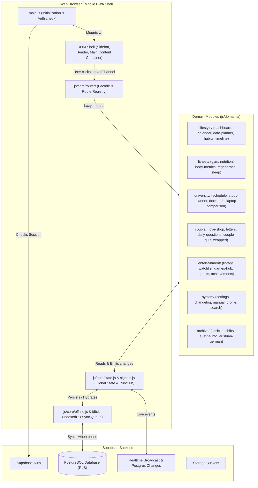
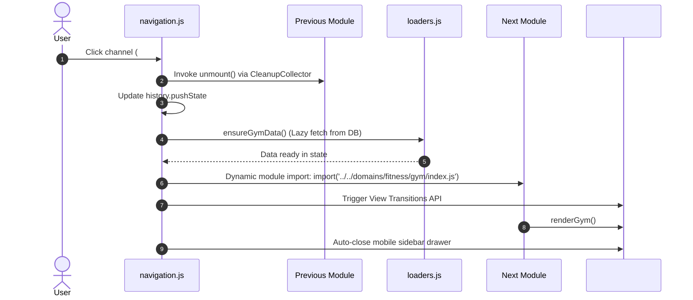

# 🏛️ Architecture & System Core

> This document provides a comprehensive technical overview of the **Kiscord** application architecture.  
> The application is designed as a modern, modular **Progressive Web App (PWA)** built on pure Vanilla JavaScript without heavy framework runtimes.

---

## 🏗️ High-Level System Architecture & Data Flow

The application implements a **Single Page Application (SPA)** architecture with dynamic code splitting and lazy loading of domain modules. This ensures near-instant initial page loads and fluid channel transitions.



---

## 🔑 Key Architectural Pillars

### 1. Application Entry Point (`main.js`)
- **Supabase client initialization** and active session verification.
- **Service Worker registration** (`public/sw.js`) for offline resilience.
- **State hydration from `IndexedDB`** cache before any network requests (zero-latency start).
- **Global event listeners** (`popstate` for browser back/forward buttons, `online`/`offline` for network state transitions).
- **Sidebar rendering** and launching the default channel (`#dashboard`).

---

### 2. Navigation & Router System (`js/core/router/` and `js/core/router.js`)

Channel navigation in Kiscord emulates Discord's channel switching. The router architecture is decoupled into:
- **`js/core/router/channel-registry.js`**: Channel definitions, icons, categories, and favorites.
- **`js/core/router/module-loader.js`**: `ROUTE_REGISTRY` mapping channel IDs to lazy dynamic imports and render adapters.
- **`js/core/router/navigation.js`**: Navigation engine handling URL history, View Transitions, breadcrumbs, and mobile drawer.
- **`js/core/router.js`**: Unified facade re-exporting the router API.



#### Core Router Capabilities:
- **Discord Multi-Server Layout (`js/core/servers.js`)**:
  - Implements the 3-column Discord UI (Server Bar $\rightarrow$ Channel Sidebar $\rightarrow$ Main View).
  - 7 Dedicated Servers (`home`, `love`, `fitness`, `fit`, `media`, `archive`, `system`) with custom icons, color badges, and active state pill indicators.
  - Server selection switches the active category/channel list in the sidebar without forcing an unwanted jump.
- **Memory Management & CleanupCollector (`js/core/module-lifecycle.js`)**: When navigating away from a channel, active event listeners, intervals, and subscriptions are cleanly disposed.
- **View Transitions API**: Where supported by the browser (`document.startViewTransition()`), screen changes transition smoothly with native-like fade and slide effects.
- **Collapsible Categories**: Organizes channels within each server into collapsible sidebar sections, saving state to the user profile.

---

### 3. Reactive State Management (`js/core/state.js` & `js/core/signals.js`)

Kiscord manages application data through a single global `state` container, domain store slices in `js/core/state/`, and fine-grained reactive signals:

```javascript
// Component subscribing to state mutations via Signals
import { createSignal, createEffect } from '../core/signals.js';

const [waterCount, setWaterCount] = createSignal(state.healthData[todayKey]?.water || 0);

createEffect(() => {
    document.querySelector('#water-display').textContent = `${waterCount()} / 8`;
});
```

#### Key Advantages:
- **Zero Framework Overhead**: No Virtual DOM reconciliation or bloated runtime libraries.
- **Immediate UI Response**: Fine-grained reactive signals update only the affected DOM nodes.
- **Unidirectional Data Flow**: Action $\rightarrow$ State Mutation $\rightarrow$ Event Emission / Signal Update $\rightarrow$ Component Re-render.

---

### 4. Offline First & Sync Queue (`js/core/offline.js` & `js/core/idb.js`)

The app remains fully functional in airplanes, subways, or during connectivity drops:
1. **Local Writes**: Data updates immediately in `state` and is synchronized to IndexedDB.
2. **Offline Interception**: If offline, `safeUpsert()`, `safeInsert()`, and `safeDelete()` append operations to the IndexedDB `sync_queue`.
3. **Automatic Flushing**: Upon receiving `window.addEventListener('online')`, the queue is processed sequentially and pushed to Supabase.

---

## 🧩 Core Infrastructure Catalog

| File | Responsibility |
|---|---|
| [`js/core/auth-handler.js`](../js/core/auth-handler.js) | Supabase authentication, session handling, and user metadata UI |
| [`js/core/router.js`](../js/core/router.js) | Router Facade aggregating Channel Registry, Navigation and Module Loader |
| [`js/core/router/`](../js/core/router/) | Decoupled routing: `channel-registry.js`, `module-loader.js`, `navigation.js` |
| [`js/core/module-lifecycle.js`](../js/core/module-lifecycle.js) | `AppModule` lifecycle contract, `CleanupCollector` and legacy adapter |
| [`js/core/servers.js`](../js/core/servers.js) | Discord 7-server architecture, server switching, active state indicators |
| [`js/core/state.js`](../js/core/state.js) | Reactive state facade unifying Domain Store Slices and SWR cache |
| [`js/core/signals.js`](../js/core/signals.js) | Reactive primitives (`createSignal`, `createEffect`, `createComputed`) |
| [`js/core/state/`](../js/core/state/) | Dedicated domain store slices (auth, gym, health, couple, fit, media, settings) |
| [`js/core/repositories/`](../js/core/repositories/) | SWR Data access layer (`BaseRepository`) |
| [`js/core/idb.js`](../js/core/idb.js) | High-capacity IndexedDB async storage engine (`keyval`, `media`, `sync_queue`) |
| [`js/core/loaders.js`](../js/core/loaders.js) | On-demand lazy data loaders for channels with `isStale()` caching |
| [`js/core/offline.js`](../js/core/offline.js) | Conflict-aware offline retry queue with exponential backoff (`sync_queue`) |
| [`js/core/security.js`](../js/core/security.js) | XSS sanitization and safe template tagging (`escapeHTML`, `safeHTML`) |
| [`js/core/sync.js`](../js/core/sync.js) | Realtime WebSockets, mood synchronization, user presence, and live canvas |
| [`js/core/theme.js`](../js/core/theme.js) | 7 visual themes engine (Default, Light, Tetris, Valentines, Christmas, Forest, Gold) |
| [`js/core/sound.js`](../js/core/sound.js) | Audio effects and sound notifications |
| [`js/core/ui.js`](../js/core/ui.js) | Global UI utilities (modals, toasts, confettis, confirmation dialogs) |

---

## 📑 Architecture Decision Records (ADR)

Historie a zdůvodnění všech zásadních architektonických rozhodnutí jsou evidovány v adresáři **[`docs/adr/`](adr/README.md)**:
* **[ADR-0001: Pure Vanilla JS Architecture with Dynamic ES Modules and SWR](adr/0001-vanilla-js-swr-architecture.md)**
* **[ADR-0002: Supabase PostgreSQL Backend with Row Level Security (RLS)](adr/0002-supabase-postgresql-rls.md)**
* **[ADR-0003: Modularize State Management into Domain Store Slices & Reactive Bus](adr/0003-domain-store-slices.md)**
* **[ADR-0004: Standardized Module Lifecycle Interface & Router Decoupling](adr/0004-module-lifecycle-router-decoupling.md)**
* **[ADR-0005: Conflict-Aware Offline Sync Queue with Exponential Backoff](adr/0005-resilient-offline-sync-conflict-detection.md)**
* **[ADR-0006: Lightweight Reactive Signals Engine (~60 LOC Vanilla JS)](adr/0006-reactive-signals-engine.md)**
* **[ADR-0007: WebRTC Peer-to-Peer Direct Intimacy Channel (Sub-10ms)](adr/0007-webrtc-peer-to-peer-channel.md)**
* **[ADR-0008: Client-Side AES-GCM Encrypted Backup & Restore (.kiscord)](adr/0008-client-side-aes-gcm-encrypted-backup.md)**
* **[ADR-0009: Discord Slash Commands & Smart Voice Logging Engine](adr/0009-discord-slash-commands-voice-logging.md)**
* **[ADR-0010: Database Performance Optimization & Unified Dashboard Bootstrap](adr/0010-database-performance-and-unified-bootstrap.md)**
* **[ADR-0011: Test Suite Architecture, Reusable Mock Builders, and Shared E2E Test Fixtures](adr/0011-test-suite-architecture-and-fixtures.md)**
