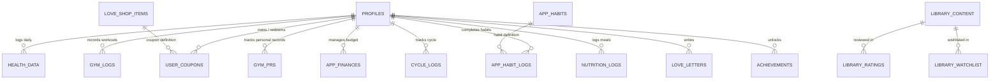

# 💾 Database Model & Performance (Supabase & PostgreSQL)

> Kiscord uses **PostgreSQL 15+** hosted on the **Supabase** platform.  
> The database architecture strictly separates personal private records and shared couple data via **Row Level Security (RLS)** policies with optimized `(SELECT auth.uid())` evaluation.

---

## 1. Table Overview by Domain



---

### 👤 Profiles, Users & Gamification

| Table | Description | Key Columns |
|---|---|---|
| `profiles` | Extended profile metadata, settings & love coins | `id` (UUID, PK), `username`, `email`, `avatar_url`, `love_coins`, `settings` (JSONB), `created_at` |
| `love_shop_items` | Couple shop coupon definitions (*Mývalí Tržnice*) | `id` (UUID), `title`, `description`, `cost`, `icon`, `category` |
| `user_coupons` | Purchased and gifted couple coupons | `id` (UUID), `shop_item_id` (FK), `owner_id` (FK), `creator_id` (FK), `note`, `is_redeemed`, `is_fulfilled`, `has_star` |
| `achievements` | Unlocked trophies and milestones | `id` (TEXT), `user_id` (UUID), `unlocked_at` |
| `achievement_definitions`| Available badge & achievement catalog | `id` (TEXT), `title`, `description`, `category`, `icon`, `color` |
| `coop_quests` | Monthly and ongoing cooperative challenges | `id` (UUID), `title`, `icon`, `target_value`, `current_value`, `reward_coins`, `is_active` |

---

### 🏋️‍♂️ Fitness, Gym & BioHacks

| Table | Description | Key Columns |
|---|---|---|
| `gym_logs` | Completed workout sessions | `id` (UUID), `user_id`, `template_id` (FK), `name`, `duration_seconds`, `date_key`, `exercises` (JSONB), `cheers` (JSONB), `logged_at` |
| `gym_prs` | Personal exercise records (1RM, volume) | `id` (UUID), `user_id`, `exercise_id`, `weight`, `reps`, `log_id` (FK), `achieved_at` |
| `gym_exercises` | Exercise registry (100+ exercises) | `id` (TEXT), `name`, `category`, `is_default`, `created_by` |
| `gym_templates` | Workout routines and templates (PPL, Fullbody) | `id` (UUID), `created_by`, `name`, `description`, `exercises` (JSONB) |
| `gym_body_measurements` | Body circumferences, weight & body fat | `id` (UUID), `user_id`, `date_key`, `weight`, `body_fat`, `chest`, `arms`, `waist`, `hips`, `thighs`, `calves`, `photo_url` |
| `health_data` | Daily health & biometric logs | `date_key` (TEXT), `user_id`, `water`, `sleep`, `mood`, `movement`, `bedtime`, `pills`, `supplements` (JSONB) |
| `nutrition_logs` | Daily meal and macronutrient logs | `id` (UUID), `user_id`, `date_key`, `meal_type`, `name`, `calories`, `protein`, `carbs`, `fats`, `fiber`, `amount_grams` |
| `nutrition_saved_foods` | Saved custom foods and database items | `id` (UUID), `name`, `brand`, `calories_100g`, `protein_100g`, `carbs_100g`, `fats_100g`, `fiber_100g` |
| `nutrition_targets` | Daily macro and calorie goals per user | `id` (UUID), `user_id`, `user_name`, `calories`, `protein`, `carbs`, `fats`, `fiber` |
| `cycle_logs` | Menstrual cycle tracking & symptoms | `id` (UUID), `user_id`, `date_key`, `flow_intensity`, `symptoms` (JSONB), `energy_level`, `mood`, `bbt_temperature` |
| `activity_step_logs` | Daily step count and active energy | `id` (UUID), `user_id`, `date_key`, `steps_count`, `distance_km`, `active_kcal`, `source` |
| `biohack_logs` | Caffeine kinetics & fasting sessions | `id` (UUID), `user_id`, `date_key`, `caffeine_entries` (JSONB), `fasting_sessions` (JSONB), `recovery_score` |
| `sleep_logs` | Deep sleep architecture & sleep synergy | `id` (UUID), `user_id`, `date_key`, `sleep_duration_hours`, `sleep_efficiency`, `restfulness_score`, `slept_together` |
| `app_habits` | Daily habit items & routines | `id` (UUID), `user_id`, `name`, `icon`, `description`, `is_shared` |
| `app_habit_logs` | Daily habit completions & streaks | `id` (UUID), `habit_id` (FK), `user_id`, `date_key` |

---

### 🎓 VUT FIT, Dorm Life & Personal Finances

| Table | Description | Key Columns |
|---|---|---|
| `school_subjects` | WIS university subjects & point requirements | `id` (UUID), `user_id`, `code`, `name`, `semester`, `points_labs`, `points_projects`, `points_midterm`, `points_exam`, `min_credit_points`, `target_grade` |
| `school_deadlines` | Projects, assignments & exams | `id` (UUID), `user_id`, `subject_code`, `title`, `type`, `deadline_date`, `deadline_time`, `is_completed` |
| `schedule_items` | Timetable lecture and lab slots | `id` (UUID), `user_id`, `subject_code`, `name`, `type`, `day_of_week`, `time_start`, `time_end`, `room`, `building` |
| `dorm_laundry` | Dorm laundry machine reservation & timer | `id` (UUID), `user_id`, `machine_number`, `started_at`, `duration_minutes`, `is_finished` |
| `dorm_shopping_items`| Shared dorm room groceries and shopping checklist | `id` (UUID), `title`, `category`, `is_bought`, `added_by` |
| `app_finances` | Personal budget & expense records | `id` (UUID), `user_id`, `title`, `amount`, `type` (income/expense), `category`, `is_shared`, `created_at` |

---

### 🍿 Entertainment, Media & Minigames

| Table | Description | Key Columns |
|---|---|---|
| `library_content` | Movies, series & games catalogue | `id` (UUID/INT), `title`, `type`, `category`, `icon`, `magnet`, `gdrive`, `tmdb_id`, `poster_path`, `rating`, `runtime`, `genres`, `release_year` |
| `library_watchlist` | Hearted / wishlist media items | `id` (UUID), `media_id` (FK), `added_by`, `type`, `created_at` |
| `library_ratings` | User reviews and watch history | `id` (UUID), `media_id` (FK), `user_id`, `status` (seen/watching/planned), `rating`, `reaction`, `seen_date` |
| `drawings` / `draw_strokes` | Draw Duel sketches & real-time canvas strokes | `id` (UUID), `drawing_id` (FK), `color`, `size`, `tool`, `points` (JSONB) |
| `pinned_drawings` | Dashboard pinned love drawing | `id` (UUID), `drawing_id` (FK), `updated_at` |
| `tetris_scores` | High scores for Tetris minigame | `user_id` (UUID, PK), `score`, `updated_at` |
| `tier_lists` | Interactive tier rankers (S-A-B-C-D) | `id` (UUID), `title`, `category`, `items_json`, `creator_id` |
| `daily_questions` / `daily_answers`| Reciprocal daily questions challenge | `id` (UUID), `question_id` (FK), `user_id`, `answer`, `created_at` |

---

### 💌 Relationship, Memories & Planning

| Table | Description | Key Columns |
|---|---|---|
| `timeline_events` | Photo timeline records & milestones | `id` (UUID), `title`, `description`, `event_date`, `icon`, `color`, `images` (array), `location_id`, `is_milestone` |
| `planned_dates` | Calendar events & date invites | `date_key` (TEXT), `name`, `cat`, `time`, `note`, `status` (idea/proposed/confirmed/completed), `proposed_by`, `checklist` |
| `bucket_list` | Shared dreams bucket list | `id` (UUID), `title`, `category`, `is_completed`, `is_priority`, `photo_url`, `created_at` |
| `date_locations` | Interactive map pinned spots | `id` (UUID), `name`, `lat`, `lng`, `category`, `description`, `image_url`, `country` |
| `love_letters` | Time-locked message capsules | `id` (UUID), `title`, `body`, `sender_id`, `recipient_id`, `is_read`, `created_at` |
| `push_subscriptions` | Web Push VAPID endpoints | `id` (UUID), `user_id`, `endpoint`, `p256dh`, `auth_key`, `user_agent` |

---

## 2. Row Level Security (RLS) & InitPlan Performance

Supabase enforces strict RLS across all tables. To guarantee maximum query planner efficiency, all policies use scalar subqueries `(SELECT auth.uid())`:

```sql
-- Optimal RLS InitPlan Pattern (evaluates auth.uid() ONCE per query instead of per-row)
ALTER TABLE public.health_data ENABLE ROW LEVEL SECURITY;

CREATE POLICY "health_data_owner_optimized" ON public.health_data
    FOR ALL TO authenticated
    USING (user_id = (SELECT auth.uid()))
    WITH CHECK (user_id = (SELECT auth.uid()));
```

---

## 3. Serverless RPC Functions (High-Performance Aggregations)

| RPC Function | Parameters | Purpose | Performance |
|---|---|---|---|
| **`get_full_dashboard_bootstrap`** | `p_user_id UUID, p_date_key TEXT` | Returns complete dashboard state (my health, partner health, pinned drawing, tetris, next event, habits & logs, active quests) in 1 network round-trip | **< 90 ms** |
| **`get_all_quest_stats`** | `month_prefix TEXT` | Aggregates all 10 co-op quest stats across tables with pattern matching in 1 query | **< 45 ms** |
| **`get_relationship_xp`** | *none* | Computes total couple XP across all domains | **< 30 ms** |
| **`get_relationship_xp_breakdown`** | *none* | Returns breakdown per domain (water, sleep, gym, timeline, bucket, questions) | **< 35 ms** |
| **`award_love_coins`** | `target_user_id UUID, amount INT, reason TEXT` | Atomic balance increment with lower bound protection | **< 15 ms** |

---

## 4. Indexing & Query Optimization Strategy

1. **Composite & Foreign Key Indexes**: All foreign keys referenced in joins are explicitly indexed (e.g. `gym_logs(user_id, logged_at DESC)`, `app_habit_logs(user_id, date_key)`).
2. **Partial Indexes**: Highly selective partial indexes for hot paths:
   - `idx_draw_strokes_live` on `draw_strokes(created_at ASC) WHERE drawing_id IS NULL`
   - `idx_coop_quests_active` on `coop_quests(is_active) WHERE is_active = true`
   - `idx_school_deadlines_pending` on `school_deadlines(deadline_date ASC) WHERE is_completed = false`
3. **Pattern Matching Indexes (`text_pattern_ops`)**:
   - `health_data(date_key text_pattern_ops)` and `nutrition_logs(date_key text_pattern_ops)` enabling index scans for queries like `WHERE date_key LIKE '2026-08%'`.
4. **Client SWR Caching**: Repositories (`GymRepository`, `CoupleRepository`, `UniversityRepository`) use IndexedDB-backed Stale-While-Revalidate caching to provide sub-10ms UI renders.
