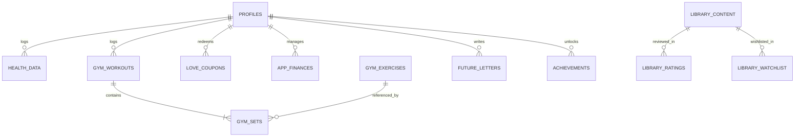

# 💾 Database Model (Supabase & PostgreSQL)

> Kiscord uses **PostgreSQL 15+** hosted on the **Supabase** platform.  
> The database architecture strictly separates personal private records and shared couple data via **Row Level Security (RLS)** policies.

---

## 1. Table Overview by Domain



---

### 👤 Profiles, Users & Gamification

| Table | Description | Key Columns |
|---|---|---|
| `profiles` | Extended profile metadata & game stats | `id` (UUID, FK auth.users), `username`, `email`, `avatar_url`, `love_coins`, `relationship_xp`, `level`, `created_at` |
| `love_coupons` | Couple shop coupon definitions | `id` (UUID), `title`, `description`, `cost`, `icon`, `category`, `redeemed_at`, `redeemed_by` |
| `achievements` | Unlocked trophies and milestones | `id` (UUID), `user_id`, `achievement_key`, `unlocked_at`, `progress` |
| `quests` | Co-op monthly and continuous missions | `id` (UUID), `title`, `description`, `target_value`, `current_value`, `is_completed`, `reward_coins` |

---

### 🏋️‍♂️ Fitness, Gym & Health

| Table | Description | Key Columns |
|---|---|---|
| `gym_workouts` | Completed workout sessions | `id` (UUID), `user_id`, `title`, `duration_seconds`, `volume_kg`, `total_sets`, `created_at` |
| `gym_sets` | Individual recorded workout sets | `id` (UUID), `workout_id` (FK), `exercise_id`, `set_order`, `reps`, `weight_kg`, `is_warmup`, `rpe` |
| `gym_exercises` | Exercise registry (100+ exercises) | `id` (TEXT), `name`, `category`, `muscle_primary`, `muscle_secondary`, `gif_url`, `instructions` |
| `gym_templates` | Workout routines and templates (PPL, Fullbody) | `id` (UUID), `user_id`, `name`, `exercises_json`, `is_shared` |
| `gym_body_measurements` | Body circumferences & weight | `id` (UUID), `user_id`, `date_key`, `weight_kg`, `waist_cm`, `arms_cm`, `chest_cm`, `photos` |
| `health_data` | Daily health & biometric logs | `date_key` (TEXT, YYYY-MM-DD), `user_id`, `water`, `sleep_hours`, `sleep_start`, `sleep_end`, `mood`, `pills` (JSONB) |
| `habits_items` | Daily habit items & streaks | `id` (UUID), `user_id`, `title`, `icon`, `target_frequency`, `history` (JSONB) |

---

### 🎓 VUT FIT, Dorm Life & Personal Finances

| Table | Description | Key Columns |
|---|---|---|
| `vut_subjects` | WIS university subjects & point limits | `id` (UUID), `code`, `name`, `credits`, `points_current`, `points_max`, `has_credit`, `has_exam` |
| `study_deadlines` | Projects, assignments & exams | `id` (UUID), `subject_code`, `title`, `due_date`, `type` (project/exam/quiz), `is_done` |
| `dorm_laundry` | Dorm laundry machine bookings | `id` (UUID), `machine_id`, `slot_start`, `slot_end`, `user_id`, `is_active` |
| `dorm_checklist` | Dorm room equipment checklist | `id` (UUID), `category`, `item_name`, `is_packed`, `assigned_to` |
| `app_finances` | Personal budget & expense records | `id` (UUID), `user_id`, `title`, `amount`, `type` (income/expense), `category` (menza/dorm/groceries/other), `date` |
| `finance_goals` | Savings goal piggy bank (*Kasička*) | `id` (UUID), `user_id`, `title`, `target_amount`, `current_amount`, `deadline` |

---

### 🍿 Entertainment, Media & Minigames

| Table | Description | Key Columns |
|---|---|---|
| `library_content` | Movies, series & games catalogue | `id` (UUID), `title`, `type` (movie/series/game), `cat`, `poster_path`, `rating`, `year`, `runtime_min` |
| `library_watchlist` | Hearted / wishlist media items | `id` (UUID), `media_id` (FK), `added_by`, `type`, `created_at` |
| `library_ratings` | User reviews and watch history | `id` (UUID), `media_id` (FK), `user_id`, `status` (watching/seen/planned), `rating`, `reaction` |
| `drawings` | Draw Duel cooperative sketches | `id` (UUID), `image_data`, `prompt`, `created_by`, `likes` |
| `tier_lists` | Interactive tier rankers (S-A-B-C-D) | `id` (UUID), `title`, `category`, `items_json`, `created_by` |
| `couple_quizzes` | Reciprocal couple quiz challenges | `id` (UUID), `creator_id`, `title`, `questions_json`, `answers_json` |

---

### 💌 Relationship, Memories & Planning

| Table | Description | Key Columns |
|---|---|---|
| `timeline_events` | Photo timeline records | `id` (UUID), `title`, `description`, `event_date`, `images` (array), `location` |
| `planned_dates` | Calendar events & date invites | `date_key`, `name`, `cat`, `status` (pending/accepted/rejected), `proposto_by` |
| `bucket_list` | Shared dreams bucket list | `id` (UUID), `title`, `category`, `is_completed`, `is_priority`, `photo_url` |
| `date_locations` | Interactive map pinned spots | `id` (UUID), `name`, `lat`, `lng`, `category`, `notes` |
| `future_letters` | Time-locked message capsules | `id` (UUID), `title`, `body`, `unlock_at`, `from_user`, `to_user`, `is_read` |

---

## 2. Row Level Security (RLS) Policies

Supabase enforces strict RLS across all tables. We implement two core security archetypes:

### A. Personal Private Data (Finances, Biometrics, Body Measurements)
Readable and writable strictly by the record owner:

```sql
ALTER TABLE public.app_finances ENABLE ROW LEVEL SECURITY;

CREATE POLICY "Personal financial access" ON public.app_finances
    FOR ALL TO authenticated
    USING (auth.uid() = user_id)
    WITH CHECK (auth.uid() = user_id);
```

### B. Shared Couple Data (Media Library, Calendar, Timeline, Dorm Checklist)
Accessible to both authenticated users:

```sql
ALTER TABLE public.library_content ENABLE ROW LEVEL SECURITY;

CREATE POLICY "Allow authenticated couple access" ON public.library_content
    FOR ALL TO authenticated
    USING (true)
    WITH CHECK (true);
```

---

## 3. Serverless Functions (PL/pgSQL RPC)

For complex data aggregations and atomic transactions, we employ stored procedures:

1. **`calculate_user_level(user_uuid)`**:
   - Aggregates XP across all activities (habits, workouts, health, bucket list) and computes the current level and progression percentage.
2. **`claim_love_coupon(coupon_uuid, user_uuid)`**:
   - Atomically validates the user's Love Coins balance, deducts the price, and marks the coupon as purchased/redeemed.
3. **`sync_workout_prs(workout_uuid)`**:
   - Scans completed workout sets and updates personal records (1RM PRs) in `gym_exercises`.

---

## 4. Storage Buckets & Policies

| Bucket | Permissions | Purpose |
|---|---|---|
| `timeline-photos` | Authenticated (Read/Write) | High-resolution memory timeline images |
| `avatars` | Public Read / Auth Write | User profile avatars |
| `gym-photos` | Private (Owner only) | Body transformation progress photos (RLS-guarded) |
| `matura-docs` | Authenticated (Read only) | Study PDF summaries and cheat sheets |
