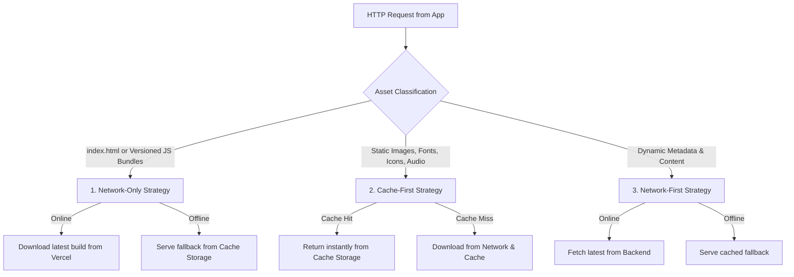
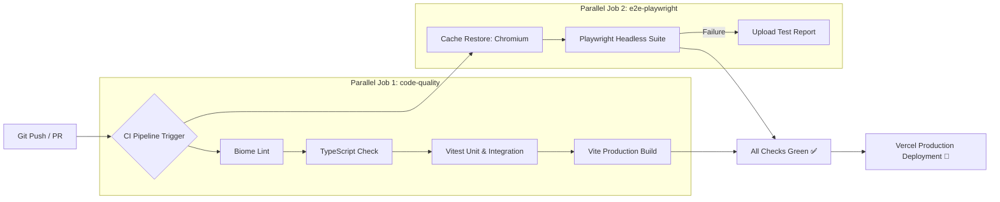

# ⚙️ DevOps, PWA & Caching Strategy

> This document details the infrastructure, Service Worker caching strategies, offline synchronization queue, test architecture, and deployment pipeline of **Kiscord**.

---

## 1. PWA & Service Worker Caching Strategy (`public/sw.js`)

The application functions as an offline-first Progressive Web App capable of immediate execution without network connectivity.



### 3-Tier Caching Hierarchy:

1. **Network-Only (with Offline Fallback)**:
   - **Target**: `index.html` and hashed JS/CSS production chunks generated by Vite.
   - **Rationale**: Guarantees that clients immediately receive newly deployed code without stale bundle bugs.

2. **Cache-First**:
   - **Target**: Static icons, Google Fonts, imagery in `/public/img/`, audio files in `/public/audio/`.
   - **Rationale**: Instantaneous rendering and zero redundant bandwidth consumption.

3. **Network-First**:
   - **Target**: General dynamic GET requests.

### Cache Invalidation & Versioning:
- Every deployment increments the version constant in `public/sw.js` (e.g., `const CACHE_NAME = 'kiscord-v2.2.0'`).
- During the `activate` event, the Service Worker automatically purges stale caches (`caches.delete(oldKey)`).
- Users can also trigger a manual cache purge and hard reload from the `#nastavení` channel.

---

## 2. Asynchronous Storage & Offline Sync Queue (`IndexedDB` & `kiscord_sync_queue`)

Kiscord employs an asynchronous **IndexedDB** engine (`js/core/idb.js`) with dedicated object stores:
- **`keyval`**: High-capacity, non-blocking storage for full state snapshots (`kiscord_state_cache`) and offline mutation queues (`kiscord_sync_queue`).
- **`media`**: Binary Blob store for offline photo staging and caching.

When mutations occur (e.g. logging a glass of water, completing a gym set, or ticking a checklist item) while disconnected:

```mermaid
sequenceDiagram
    autonumber
    actor User
    participant Mod as Module (e.g., health.js)
    participant Off as offline.js (safeUpsert)
    participant State as state.js & IndexedDB
    participant Net as Supabase Backend

    User->>Mod: User action (Water +1)
    Mod->>Off: safeUpsert('health_data', record)
    Off->>State: Optimistic update in memory & IndexedDB
    Note over Off: Check connectivity (navigator.onLine)
    
    alt User is ONLINE
        Off->>Net: Direct PostgreSQL write
        Net-->>Off: Success (200 OK)
    else User is OFFLINE
        Off->>State: Append payload to kiscord_sync_queue (IndexedDB)
        Off-->>User: Display "Saved offline" toast
        Note over Off: Awaiting network restoration
        User->>Off: window.online event fires
        Off->>Net: Process and send queued operations sequentially
        Net-->>Off: Confirm sync
        Off->>State: Purge kiscord_sync_queue
    end
```

---

## 3. Test Architecture (Vitest & Playwright)

The project includes an extensive test suite ensuring high reliability across all modules.

### A. Unit & Integration Testing (Vitest)
- **Configuration**: `vitest.config.js`
- **Environment**: `happy-dom` (lightweight in-memory DOM simulation)
- **Scope**: 75 test files, 528 test cases covering:
  - State management, signals, and cache hydration (`tests/integration/offline-sync.test.js`, `signals.test.js`)
  - 7 themes visual engine (`tests/unit/theme.test.js`)
  - Gym tracker, 1RM analytics, and rest timer (`tests/unit/gym-*.test.js`)
  - Collapsible sidebar categories and router (`tests/unit/sidebar-categories.test.js`)
  - Minigame engines and puzzle mechanics (`tests/unit/puzzle.test.js`)

```bash
# Run all unit and integration tests
npm run test:run

# Run tests in interactive watch mode
npm test
```

### B. End-to-End Testing (Playwright)
- **Configuration**: `playwright.config.js`
- **Environment**: Chromium headless (with automatic Vite dev server bootstrap on `localhost:3000`)
- **Fixtures & Mocking**: `tests/fixtures/playwright-helpers.js` provides hermetic Supabase auth simulation (`localStorage` token injection) and network route interception (`page.route('**/rest/v1/**')`) with HTTP HEAD `content-range` emulation.
- **Test Specifications** (6 tests in 5 files, 100% passing):
  1. `tests/e2e/letters-locking.spec.js`: Verifies time-locked love letters (countdown badge, lock state, unlocked content reveal).
  2. `tests/e2e/bucketlist-upload.spec.js`: Verifies bucketlist card rendering, status filters, and modal photo upload simulation.
  3. `tests/e2e/tinder-matcher.spec.js`: Multi-user dual browser context test (Jožka & Klárka), testing real-time swipe synchronization and MATCH popup modal.
  4. `tests/e2e/calendar-shifts.spec.js`: Tests Calendar 3.0 Spatial Zen rendering, Joint Day Off 🌴 detection, and quick-add shift conflict confirmation dialog (`#app-confirm-dialog`).
  5. `tests/e2e/quests-progression.spec.js`: Verifies cooperative quest progress calculation, consolidated RPC mocking, and Admin modal quest creation.

```bash
# Run all Playwright E2E tests (headless)
npm run test:e2e

# Run single test file
npx playwright test tests/e2e/quests-progression.spec.js

# Run with interactive Playwright UI
npm run test:e2e:ui

# View HTML test report
npm run test:e2e:report
```

### C. Static Code Analysis & Formatting (Biome)
- **Configuration**: `biome.json`
- **Engine**: `@biomejs/biome` (Rust-based, sub-500ms execution across 400+ files)
- **Scope**: Lints JS/TS/CSS/JSON, flags unused imports/variables, eliminates `var`, ensures consistent formatting.

```bash
# Run ultra-fast linter
npm run lint

# Auto-fix safe lint warnings
npm run lint:fix

# Format files according to style guidelines
npm run format
```

---

## 4. Build Pipeline & Deployment (GitHub Actions & Vercel)

### A. Continuous Integration Pipeline (`.github/workflows/ci.yml`)

Every push to `main` or `develop` and every pull request targeting `main` automatically triggers our GitHub Actions CI workflow.



- **Execution Strategy**: Parallel execution of `code-quality` and `e2e-playwright` achieves sub-2-minute execution.
- **Smart Caching**:
  - `actions/setup-node@v4` with `cache: 'npm'` for packages.
  - `actions/cache@v4` caching `~/.cache/ms-playwright` keyed against `package-lock.json` hash (saves ~180 MB download per run).
- **Concurrency & Resource Protection**:
  - `concurrency: { group: ..., cancel-in-progress: true }` immediately cancels obsolete runs on new commits.
- **Local Simulation**:
  ```bash
  # Run complete CI suite locally in one command
  npm run test:ci
  ```

### B. Production Hosting & Deployment (Vercel)

- **Bundler**: [Vite 6](https://vitejs.dev/) with ES module chunking.
- **CSS Processor**: Tailwind CSS v4 + PostCSS (`@tailwindcss/postcss`).
- **Hosting**: [Vercel](https://vercel.com/) with automated CI/CD builds on each push to `main`.
- **Vercel Headers Configuration (`vercel.json`)**:
  - Sets explicit cache-control headers for the Service Worker:
    ```json
    {
      "headers": [
        {
          "source": "/sw.js",
          "headers": [
            { "key": "Cache-Control", "value": "no-cache, no-store, must-revalidate" }
          ]
        }
      ]
    }
    ```

