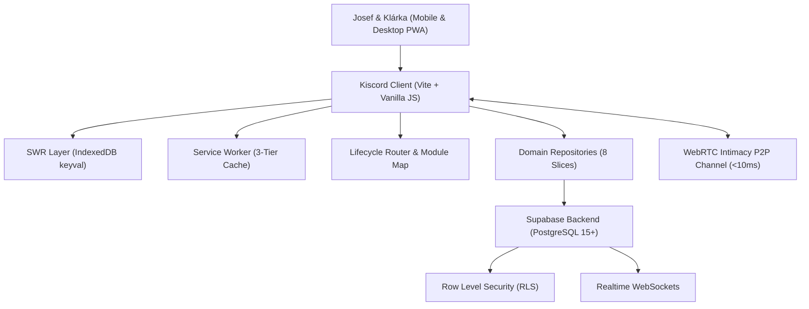

# Kiscord Developer Onboarding & Architecture Guide

> **Comprehensive engineering guide and onboarding reference for Kiscord (Project-K).**  
> This interactive document guides engineers, architects, and contributors through local setup, system architecture, Supabase database modeling, repository contracts, and developer workflows.

---

## 1. Project Overview & Context

Kiscord is a highly customized, private **Progressive Web App (PWA)** styled after Discord (dark mode, glassmorphism, channel sidebar, notification chimes, haptics, and fluid animations). It is built specifically for two primary users (**Josef & Klárka**) as a central companion application for daily life, university studies, couple goals, and fitness.



### Core Functional Domains
1. **Daily Routine & Health**: Hydration tracker (8 droplets), sleep logging with active session timers, mood tracking with reactive SVG sunflowers, and daily notes.
2. **University Studies (VUT FIT & Dorm Life)**: Timetables with room hints, WIS points tracker, assignment deadlines, floor laundry room machine bookings, room packing checklist, personal finances, and Matura exam flashcards.
3. **Fitness Ecosystem (Gym Tracker & Calendar 2.0)**: 15-module gym tracker featuring a floating active workout HUD, rest timer with sound/haptics, 100+ animated GIF exercises, 1RM progression charts, anatomical muscle volume heatmaps, body measurement tracking, and unified calendar synergy.
4. **Relationship, Dreams & Memories**: Couple coupon shop redeemable with Love Coins, interactive date map (Leaflet), shared bucket list, photo timeline, time-locked message capsules, and partner radar countdowns.
5. **Entertainment & Arcade**: Media library with TMDB integration, mutual match discovery (*Spolu-seznam*), dedicated movie/series/game Tinder Matchers, and two-player Arcade Hub (Draw Duel, Couple Quizzes, Who Is More Likely To?, Photo Puzzle, Tetris War).

---

## 2. Quick Start & Local Setup

Setting up a fresh development environment takes under 5 minutes.

### Prerequisites

| Tool | Required Version | Purpose |
|---|---|---|
| **Node.js** | `>= 20.0.0` (LTS) | JavaScript runtime environment |
| **npm** | `>= 10.0.0` | Package and script manager |
| **Modern Browser** | Chrome / Edge / Safari / Firefox | Testing PWA, IndexedDB, and View Transitions API |

### Setup Commands

```bash
# 1. Clone the repository
git clone https://github.com/josefmvalek/project-k.git
cd project-k

# 2. Install dependencies
npm install

# 3. Start local development server (Vite)
npm run dev

# 4. Run test suites & type check
npm run test:run
npm run typecheck
```

> [!NOTE]
> The development server runs on `http://localhost:5173`. Thanks to Vite Hot Module Replacement (HMR), edits to JavaScript, CSS, and HTML are reflected instantly.

### Verification Checklist
- [x] Dev server is running on `http://localhost:5173` without terminal or browser console errors.
- [x] **All 75 test suites (528 tests) pass cleanly** via `npm run test:run`.
- [x] Static type check passes with 0 errors via `npm run typecheck`.
- [x] Navigating to the page renders the Discord-themed dashboard and collapsible sidebar.
- [x] DevTools $\rightarrow$ Application confirms the Service Worker is registered and IndexedDB (`kiscord_db`) holds cached state.

---

## 3. Technology Stack & Design Decisions

Kiscord intentionally avoids heavy frontend frameworks (React, Angular). Instead, it prioritizes maximum speed, zero runtime overhead, and clean vanilla JavaScript.

| Layer | Technology | Rationale |
|---|---|---|
| **Core Frontend** | Vanilla JavaScript (ES6+ Modules) | Zero framework runtime cost, instant DOM manipulation, complete memory control |
| **Data Access** | SWR Repository Layer (`BaseRepository`) | Local-first instant UI rendering backed by IndexedDB cache + background sync |
| **Type Safety** | JSDoc + Supabase TypeScript Types | Compile-time validation without bundling step (`tsc -p jsconfig.json`) |
| **Styling & Theming** | CSS Variables + Tailwind CSS | Authentic Discord Dark theme, 7 switchable themes, glassmorphism blur effects |
| **Build Tooling** | Vite 6 | Lightning-fast startup, ES module dynamic code splitting, rapid HMR |
| **Backend & DB** | Supabase (PostgreSQL 15+) | Row Level Security (RLS), Realtime WebSockets, Storage buckets, PL/pgSQL RPCs |
| **Local Storage** | IndexedDB (`js/core/idb.js`) | Asynchronous, non-blocking, multi-gigabyte capacity for state & binary assets |
| **PWA & Offline** | Service Worker + Cache API | 3-tier caching hierarchy, zero-data-loss offline sync queue |
| **Unit Testing** | Vitest + Happy-DOM | High-speed in-memory testing (75 suites, 528 tests in <20s) |
| **E2E Testing** | Playwright | Multi-browser end-to-end automation for critical user journeys |
| **Hosting & CI/CD** | Vercel | Instant deployments and branch previews on every push |

---

## 4. Core Architecture & Application Lifecycle

The application operates as a **Single Page Application (SPA)** with dynamic on-demand module loading and standardized component lifecycle management.

```
                    ┌────────────────────────┐
                    │    index.html Shell    │
                    └───────────┬────────────┘
                                │ (Initial Load)
                                ▼
                    ┌────────────────────────┐
                    │     js/main.js Init    │
                    └───────────┬────────────┘
                                │
        ┌───────────────────────┼───────────────────────┐
        ▼                       ▼                       ▼
┌───────────────┐       ┌───────────────┐       ┌───────────────┐
│  js/core/     │       │  js/core/     │       │  js/core/     │
│  auth.js      │       │  state.js     │       │  router/      │
└───────┬───────┘       └───────┬───────┘       └───────┬───────┘
        │                       │ (IndexedDB SWR Cache) │
        │                       ▼                       ▼
        │               ┌───────────────┐       ┌───────────────┐
        │               │ js/core/      │       │ Dynamic       │
        │               │ idb.js        │       │ Module Import │
        │               └───────────────┘       └───────────────┘
        │                                               │
        └───────────────────────┬───────────────────────┘
                                ▼
                    ┌────────────────────────┐
                    │  Render Channel to DOM │
                    └────────────────────────┘
```

### 1. Data Access & Repositories Layer (`js/core/repositories/`)
Standardized repository pattern abstracting Supabase API interactions and SWR caching:
- `BaseRepository.js`: Core CRUD operations (`getAll`, `getById`, `save`, `insert`, `update`, `delete`), SWR cache management (`getWithSWR`, `getAllWithSWR`), and cache invalidation.
- `GymRepository.js`: Exercises catalog (24h TTL cache), workout logs, and PRs.
- `HealthRepository.js`: Daily hydration, sleep, mood, and notes.
- `FinanceRepository.js`: Brno monthly expenses and budget entries.
- `MediaRepository.js`: Movies, TV series, games, and shared watchlist.
- `CoupleRepository.js`: Love Shop coupons, Love Letters, Daily Questions, and Confessions.
- `UniversityRepository.js`: School subjects, deadlines, timetable items, and Matura flashcards.
- `EntertainmentRepository.js`: Gamified achievements, co-op quests, and custom tierlists.
- `SystemRepository.js`: Release changelogs and system settings.

### 2. State Management & Reactive Signals (`js/core/state.js` & `js/core/signals.js`)
- Single reactive state container `state`.
- **Pub/Sub Event Bus (`stateEvents`)**: UI modules subscribe to domain channels (e.g. `stateEvents.on('gym', callback)`).
- **Reactive Signals Engine**: Ultra-lightweight reactive primitives (`createSignal`, `createEffect`, `createMemo`) for fine-grained DOM updates without re-renders.

### 3. Module Lifecycle & Router (`js/core/router/`)
- `switchChannel(channelId)` orchestrates:
  1. Invoking cleanup callbacks (`destroy()`) to prevent event listener and timer leaks.
  2. Pushing state to browser history (`history.pushState`).
  3. Dynamic asynchronous loading via `import()`.
  4. Rendering UI with native **View Transitions API**.
  5. Automatic responsive drawer closing on mobile.

---

## 5. Major Feature Engines

### 📅 Calendar 2.0 Engine (`js/domains/lifestyle/calendar/`)
- **24-Hour Week Grid (`week-view.js`)**: Interactive 24-hour visual time matrix with full drag-and-drop event manipulation.
- **Dynamic Collision Resolver (`time-engine.js`)**: Automatic slot assignment and offset calculation for overlapping events.
- **Fit-to-Viewport Month Grid (`month-view.js`)**: Responsive CSS Grid layout with cell badges for gym workouts, study deadlines, dates, and mood indicators.
- **Agenda View Mode (`agenda-view.js`)**: Linear chronological list grouping past, today's, and future events with sticky headers.
- **Quick Event Popover (`quick-popover.js`)**: Instant event preview on click with one-tap status toggles and delete actions.
- **Natural Language Parsing Quick-Add (`nlp-quick-add.js`)**: Parses queries like *"Zítra v 18:00 večeře"* into structured events.
- **Partner Radar & Date Countdown (`partner-radar.js`)**: Live visual countdown to the nearest shared couple date.
- **Meteorological Forecasts (`weather.js`)**: Integrated seasonal temperature and weather forecasts per date.
- **ICS Calendar Sync (`ics-sync.js`)**: Export calendar events to standard iCalendar format (.ics) for Apple/Google Calendar.

### 🏋️ Gym Tracker & Active Workout HUD (`js/domains/fitness/gym/`)
- **Floating Active Workout HUD (`active-workout/`)**: Persistent overlay during workouts with exercise progress, set logging, and quick notes.
- **Smart Rest Interval Timer**: Countdown timer with customizable intervals, audio chimes, and haptic feedback.
- **1RM Progression & Volume Analytics (`analytics.js`)**: Automatic One Rep Max estimation (Brzycki formula) and muscle group volume heatmaps.
- **Personal Records (PR) Engine**: Automatic detection and celebratory animation upon achieving new personal bests.

---

## 6. Architecture Decision Records (ADR 0001–0011)

Kiscord follows the Michael Nygard / MADR standard for architectural documentation:

| ADR | Title | Status | Date | Core Impact |
|---|---|---|---|---|
| [ADR-0001](adr/0001-vanilla-js-swr-architecture.md) | Pure Vanilla JS Architecture with Dynamic ES Modules and SWR Cache | **Accepted** | 2026-08-21 | Zero-framework runtime, instant local loading |
| [ADR-0002](adr/0002-supabase-postgresql-rls.md) | Supabase PostgreSQL Backend with Row Level Security (RLS) | **Accepted** | 2026-08-22 | Multi-tenant security for private couple app |
| [ADR-0003](adr/0003-domain-store-slices.md) | Modularize State Management into Domain Store Slices & Reactive Bus | **Accepted** | 2026-08-23 | Domain separation of concerns |
| [ADR-0004](adr/0004-module-lifecycle-router-decoupling.md) | Standardized Module Lifecycle Interface & Router Decoupling | **Accepted** | 2026-08-23 | Elimination of memory and event listener leaks |
| [ADR-0005](adr/0005-resilient-offline-sync-conflict-detection.md) | Conflict-Aware Offline Sync Queue with Exponential Backoff | **Accepted** | 2026-08-23 | Guaranteed data persistence in low-connectivity |
| [ADR-0006](adr/0006-reactive-signals-engine.md) | Lightweight Reactive Signals Engine (~60 LOC Vanilla JS) | **Accepted** | 2026-08-23 | Fine-grained reactive DOM binding |
| [ADR-0007](adr/0007-webrtc-peer-to-peer-channel.md) | WebRTC Peer-to-Peer Direct Intimacy Channel (Sub-10ms) | **Accepted** | 2026-08-23 | Low-latency live couple interactions |
| [ADR-0008](adr/0008-client-side-aes-gcm-encrypted-backup.md) | Client-Side AES-GCM Encrypted Backup & Restore (.kiscord) | **Accepted** | 2026-08-23 | End-to-end encrypted manual backups |
| [ADR-0009](adr/0009-discord-slash-commands-voice-logging.md) | Discord Slash Commands & Smart Voice Logging Engine | **Accepted** | 2026-08-23 | Natural language and voice input processing |
| [ADR-0010](adr/0010-database-performance-and-unified-bootstrap.md) | Database Performance Optimization & Unified Dashboard Bootstrap | **Accepted** | 2026-08-26 | Compound indexes, optimized RPCs, single query bootstrap |
| [ADR-0011](adr/0011-test-suite-architecture-and-fixtures.md) | Test Suite Architecture, Reusable Mock Builders, and Shared E2E Test Fixtures | **Accepted** | 2026-08-26 | Standardized mock fixtures and headless browser tests |

---

## 7. Database Schema & Security (Supabase)

Database operations run on PostgreSQL 15+ in Supabase with strict **Row Level Security (RLS)** enforcement.

```
                    ┌─────────────────────────┐
                    │      auth.users         │
                    └────────────┬────────────┘
                                 │
                                 ▼
                    ┌─────────────────────────┐
                    │     public.profiles     │
                    └────────────┬────────────┘
                                 │
        ┌────────────────────────┼────────────────────────┐
        ▼                        ▼                        ▼
┌──────────────┐         ┌──────────────┐         ┌──────────────┐
│ health_data  │         │   gym_logs   │         │ app_finances │
└──────────────┘         └───────┬──────┘         └──────────────┘
                                 │
                                 ▼
                         ┌──────────────┐
                         │   gym_prs    │
                         └──────────────┘
```

### Security Archetypes:
1. **Private Personal Tables** (`app_finances`, `health_data`, `gym_body_measurements`):
   - Policy: `auth.uid() = user_id`. User records remain completely isolated.
2. **Shared Couple Tables** (`library_content`, `timeline_events`, `planned_dates`, `dorm_checklist`, `user_coupons`):
   - Policy: `authenticated` users have full read and write access.

---

## 8. Developer Cookbook & Common Recipes

### Recipe A: Adding a New Repository Method
1. Open the corresponding domain repository in `js/core/repositories/`.
2. Wrap remote queries with `getWithSWR` or `getAllWithSWR` to benefit from automatic IndexedDB caching and TTL invalidation:
   ```javascript
   async getCustomData(options = {}) {
       return this.getWithSWR(
           'custom_data_cache_key',
           async () => {
               const { data, error } = await supabase.from('my_table').select('*');
               if (error) throw error;
               return data || [];
           },
           options
       );
   }
   ```

### Recipe B: Running Verification Tests
```bash
# Run all 75 unit/integration test suites (528 tests)
npm run test:run

# Run TypeScript type check
npm run typecheck

# Run Playwright E2E tests
npm run test:e2e
```

---

## 9. Troubleshooting & Debugging Guide

1. **Client displays stale build after deployment**:
   - Increment `CACHE_NAME` in `public/sw.js`.
   - In the application, open `#nastavení` and trigger **"Clear Cache and Reload"**.
2. **Offline queue failed to synchronize**:
   - Inspect the `sync_queue` store in IndexedDB (`kiscord_db`) via DevTools Application tab.
   - Check console logs for database constraint errors.
3. **RLS permission denied (403)**:
   - Ensure the user is logged in with a valid session via `supabase.auth.getSession()`.
   - Verify that an active policy exists on the table for role `authenticated`.

---
*Documentation compiled for project Kiscord (Project-K).*
